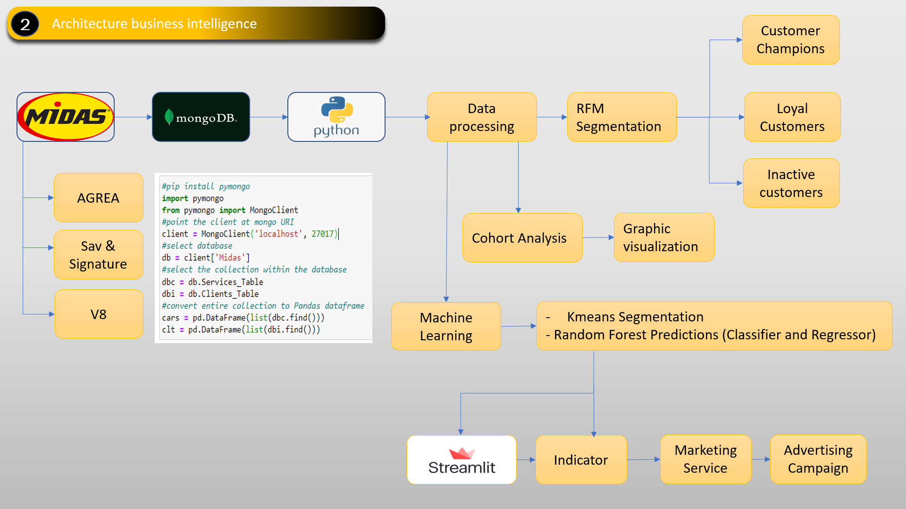
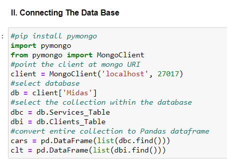

# Customer_Behavior_Analysis

an Overview

### Mongo db and python connection

In my project, I extracted the data from the midas application and then migrated it to mongodb to import it into python using the "PYMONGO" library.

## Data collection

At first, I collected the database (direct download from the system).

## Migration to MongoDB 

I migrated all the data to MongoDB to create a sort of system database. 

## Python (processing)

I installed the pymongo library. A library that can connect locally with MongoDB. I then imported the database using this library, and began processing it, i.e. exploring the database, processing the variables... 

## RFM analysis

I brought out the famous RFM (Recency, Frequency, Monetary) analysis.

## Cohort Analysis

Afterwards, I did the cohort analysis, taking part of the data (the last 120 days). 

## Implementing Machine Learning 

Clustering segmentation with Kmeans, prediction with Random forest regressor and Application Streamlit.

## Application

An application that serves as a decision support tool for the marketing department.

## A Business Intelligence Architechture

Business intelligence architecture

# MIDAS DATA ANALYSIS STEPS

- Exploratory detail 

I processed the data with python, going through these different processing stages.

- Define objective
- Data collection
- Exploratory analysis
- Data Preparation
- Data Preprocessing (Feature Engineering)
- Modeling
- Local deployment
- The objective definition phase

This mainly involves analyzing customer behavior and coming up with indicators that will enable the marketing department to launch an advertising campaign targeting these customers.

- Data collection

Two databases 

- The first contains information on the services provided.
- The second contains information on customers
- Exploratory analysis

### In this section, I have tried to understand the data by going through various stages

- The dimension of the DataFrame,
- What variables to study 
- Variable types
- Graphical visualization 
- Handling null values
- Handling variables with redundant information (deletion, fillna...)
- Univariate analysis (Central tendency parameters)
- Bivariate analysis (Correlation) 
- Graphical visualization

## Data Preprocessing (Feature Engineering)

- RFM analysis
- Cohort Analysis

## Modeling

- Implementation of the kmeans algorithm for segmentation
- Implementation of Random Forest Regressor algorithm to predict customer spend
- Implementation of Random Forest Classifier algorithm for customer purchase probability

## Local deployment

- Streamlit Application
